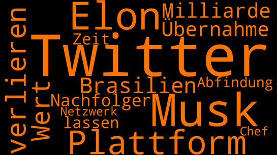

# Newscloud

(German version below!)

Welcome to Newscloud! With this web app, you can create a word cloud by scraping german news for a specific search term. For example, the following word cloud was created for the search term "Twitter" on October 1, 2024. On this day, it was discussed (again) how much market value Twitter has lost since the takover by Elon Musk. The color of the word cloud is an indicator for the mean sentiment of the scraped news: the continuum ranges from red (negative) to green (positive). The sentiment is analyzed with [this model by Oliver Guhr](https://huggingface.co/oliverguhr/german-sentiment-bert).

The design of the code is based on the [**observer design pattern**](https://refactoring.guru/design-patterns/observer) in the broadest sense: One single instance of the class Eventmanager serves as a coordinator between the classes Scraper_Worker, Analyzer_Worker and User_Interface. This instance (named Eventmanager_A in the file Newscloud.py) has an attribute _Events_Dict. This is a dictionary that contains the names of specific events as keys and the subscriber functions and their parameter as values (as another dictionary).

So the main script of the web app is Newscloud.py. To work the web app properly just needs one instance of the Eventmanager, Scraper_Worker, Analyzer_Worker and User_Interface class (the objects named Eventmanager_A, Scraper_Worker_A, Analyzer_Worker and User_Interface_A). The objects Scraper_Worker_A and Analyzer_Worker_A receive their "jobs" from the object Eventmanager_A if they are subscribers of an event. For example the Scraper_Worker_A object is a subscriber of the event "Button_gedrueckt". This means when a user presses the button in the user interface to initiate a new scraping order, at first it is signalled to the Eventmanager_A that an event has happened (search for "Funk_Event_eingetreten" in User_Interface.py). Then the Eventmanager_A notifies every subscriber function of this event and hands over necessary arguments to these subscriber functions. In the case of the Scraper_Worker_A this means that its method "Funk_Auftrag_annehmen" is a subscriber function of the event "Button_gedrueckt". After the Scraper_Worker_A has done all the scraping related work it publishes another event to the Eventmanager_A named "Fertig_geschuerft". Now the Analyzer_Worker_A can start to work following the same principle.

The web app is built with the framework [**Streamlit**](https://streamlit.io/). The most important characteristic of Streamlit is that the main script of the web app (Newscloud.py) runs again from top to bottom every time the user presses a button. Buttons can be used in [several ways](https://docs.streamlit.io/library/advanced-features/button-behavior-and-examples) to affect subsequent runs of the main script. In this web app the "communication" between runs happens by using the Streamlit feature [session_state](https://docs.streamlit.io/library/api-reference/session-state) which allows to store information between runs. So the results of the already processed orders sent by the user are saved in this session_state (search for method "_Funk_Ergebnisse_speichern" in the Analyzer_Worker class).

Because the web app should run on [**Heroku Eco Dynos**](https://devcenter.heroku.com/articles/dyno-types) and the language model is already of significant size, only 3 word clouds can be saved per user at the same time (the data for the word clouds are saved in memory, not in the SQL database). The oldest word cloud will be deleted if the user searches for a forth search term.

## Prerequisites and requirements

The limit for requests (respectively orders) summed over all users is implemented by the SQL class SQL_Klasse_Tracker which monitors the sum of all processed orders in a specific timeframe (definded in Constants.py). The web app is built to be deployed with Heroku and uses the [**PostgreSQL database add-on**](https://elements.heroku.com/addons/heroku-postgresql). If you want to run the app locally, you have to access the PostgreSQL database as remote.

The requirements.txt contains the packages for deployment on Heroku. You also have to add an nltk.txt file to your repository for Heroku to download the [nltk punkt sentence tokenizer](https://www.nltk.org/_modules/nltk/tokenize/punkt.html) in the [deployment process](https://devcenter.heroku.com/articles/python-nltk). If you want to use the app locally, you have to download punkt with [nltk.download(punkt)](https://www.nltk.org/data.html) in your virtual environment.

The deployment was done with Python 3.9.18. The code is divided into cells by using the seperator "# %%". In this way, the code can be exported as Jupyter notebook in VS Code.

## Disclaimer

To actually use the web app, there are some to-dos which are not described here because the author does not want to encourage web scraping of the particular site (which is not allowed). The code is for general demonstration purposes only. Also notice that there is [**no license**](https://docs.github.com/en/repositories/managing-your-repositorys-settings-and-features/customizing-your-repository/licensing-a-repository) for this project, so (re)use of the code is prohibited.

--------------------------------------------------------------------------------------------------------------
# Deutsche Version

Willkommen bei Newscloud! Mit dieser Web App kannst du eine Wordcloud erstellen, indem du Webscraping von deutschsprachigen News für einen bestimmten Suchbegriff anwendest. Beispielsweise wurde folgende Wordcloud für den Suchbegriff "Twitter" erstellt (am 1. Oktober 2024). An diesem Tag wurde (wieder) darüber diskutiert, wie viel Marktwert Twitter seit der Übernahme durch Elon Musk verloren hat. Die Farbe der Wordcloud ist ein Indikator für das mittlere Sentiment der gescrapten News: Das Kontinuum reicht von rot (negativ) bis grün (positiv). Das Sentiment wird mit [diesem Modell von Oliver Guhr](https://huggingface.co/oliverguhr/german-sentiment-bert) analysiert.

Das Design des Codes basiert im weitesten Sinne auf dem [**Observer Design Pattern**](https://refactoring.guru/design-patterns/observer): Eine Instanz der Klasse Eventmanager dient als Koordinator der Klassen Scraper_Worker, Analyzer_Worker und User_Interface. Diese Instanz (mit dem Namen Eventmanager_A in der Datei Newscloud.py) besitzt ein Attribut _Events_Dict. Dies ist ein Dictionary, welches die Namen von spezifischen Events als Keys und die Subscriber Funktionen und deren Parameter als Values enthält (als ein weiteres Dictionary).

Das Main Script der Web App ist also Newscloud.py. Um zu funktionieren, braucht die Web App jeweils nur eine Instanz der Eventmanager, Scraper_Worker, Analyzer_Worker und User_Interface Klasse (die Objekte mit dem Namen Eventmanager_A, Scraper_Worker_A, Analyzer_Worker_A und User_Interface_A). Die Objekte Scraper_Worker_A und Analyzer_Worker_A erhalten ihre "Jobs" vom Objekt Eventmanager_A, sofern sie Abonnenten eines Events sind. Zum Beispiel ist das Objekt Scraper_Worker_A ein Abonnent des Events "Button_gedrueckt". Wenn also ein/e Nutzer/in den Button im User Interface drückt, um einen neuen Scraping-Auftrag zu initiieren, wird zunächst an den Eventmanager_A signalisiert, das ein Event stattgefunden hat (suche nach "Funk_Event_eingetreten" in User_Interface.py). Darauf benachrichtigt der Eventmanager_A jede Abonnenten-Funktion dieses Events und übergibt notwendige Argumente an diese Abonnenten-Funktionen. Im Falle vom Scraper_Worker_A bedeutet dies, dass dessen Methode "_Funk_Auftrag_annehmen" eine Abonnenten-Funktion des Events "Button_gedrueckt" ist. Nachdem der Scraper_Worker_A die ganze Scraping-bezogene Arbeit verrichtet hat, veröffentlicht er ein weiteres Event an den Eventmanager_A mit dem Namen "Fertig_geschuerft". Nun kann der Analyzer_Worker_A seine Arbeit nach demselben Prinzip aufnehmen.

Die Web App ist mit dem Framework [**Streamlit**](https://streamlit.io/) erstellt. Das wichtigste Merkmal von Streamlit ist, dass das Main-Skript der Web App (Newscloud.py) erneut von Anfang bis Ende durchlaufen wird, wann immer der/die User/-in einen Button drückt. Buttons können auf [unterschiedliche Weise](https://docs.streamlit.io/library/advanced-features/button-behavior-and-examples) genutzt werden, um nachfolgende Durchläufe des Main-Skripts zu beeinflussen. In dieser Web App erfolgt die 'Kommunikation' zwischen verschiedenen Durchläufen mittels des Streamlit Features [session_state](https://docs.streamlit.io/library/api-reference/session-state), welches die Speicherung von Informationen zwischen verschiedenen Runs erlaubt. Somit werden die Ergebnisse der bereits verarbeiteten Aufträge eines/er User/-in in diesem session_state gespeichert (suche nach "_Funk_Ergebnisse_speichern" in der Analyzer_Worker Klasse).

Weil die Web App auf [**Heroku Eco Dynos**](https://devcenter.heroku.com/articles/dyno-types) laufen soll und auch das Sprachmodell viele Ressourcen benötigt, werden je Nutzer/in nur 3 Wordclouds zu einem gegebenen Zeitpunkt gespeichert (die Daten werden in memory gespeichert, nicht in der SQL Datenbank). Die älteste Wordcloud wird gelöscht, wenn der/die User/-in nach einem vierten Suchbegriff sucht.

## Voraussetzungen und Anforderungen

Das Limit für Anfragen (bzw. Aufträge) summiert über alle User/-innen ist mittels der SQL Klasse SQL_Klasse_Tracker implementiert, welche die Summe aller verarbeiteten Aufträge in einem spezifischen Zeitraum überwacht (definiert in Constants.py). The Web App soll mit Heroku deployed werden und nutzt das [**PostgreSQL database Add-on**](https://elements.heroku.com/addons/heroku-postgresql). Wenn du die App lokal nutzen möchtest, musst du auf die PostgresSQL Datenbank remote zugreifen.

Die Datei requirements.txt enthält die Packages für das Deployment bei Heroku. Du musst zudem eine Datei nltk.txt zu deinem Repository für Heroku hinzufügen, um den [nltk punkt Sentence Tokenizer](https://www.nltk.org/_modules/nltk/tokenize/punkt.html) während des [Deployment Prozesses](https://devcenter.heroku.com/articles/python-nltk) zu downloaden. Wenn du die App lokal nutzen möchtest, musst du punkt mit [nltk.download(punkt)](https://www.nltk.org/data.html) in deinem virtuellen Environment downloaden.

Das Deployment erfolgte mit Python 3.9.18. Der Code ist mittels des Seperators "# %%" in Zellen unterteilt. Auf diese Weise kann der Code in VS Code als Jupyter Notebook exportiert werden.

## Disclaimer

Um die Web App tatsächlich zu nutzen, sind einige weitere Aufgaben zu erledigen, die hier nicht beschrieben wurden, weil der Autor nicht zum Web Scraping der Seite ermutigen möchte (solches ist nämlich nicht erlaubt). Der Code dient nur allgemeinen Demonstrationszwecken. Es sei außerdem darauf hingewiesen, dass [**keine Lizenz**](https://docs.github.com/en/repositories/managing-your-repositorys-settings-and-features/customizing-your-repository/licensing-a-repository) für dieses Projekt vorliegt, sodass eine (Weiter-)verwendung dieses Codes nicht erlaubt ist.